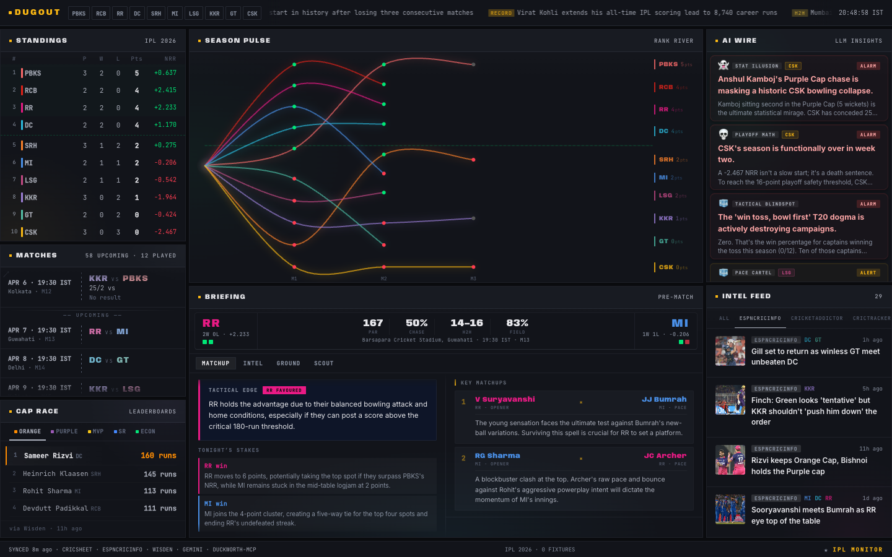

<div align="center">

# DUCKWORTH DUGOUT

**IPL season war room. Standings, pulse, cap races, match intel — one screen, zero fluff.**

[](https://ankitksr.github.io/duckworth-dugout)
[](LICENSE)

</div>

<br>

<a href="https://ankitksr.github.io/duckworth-dugout">
  
</a>

<br>

This is not a cricket score app. It's an analyst's war room — dark, dense, built for situational awareness. Glance at the Dugout and know who's winning, who's surging, what's at stake tonight, and what the numbers say about tomorrow.

The AI layer isn't decorative — it synthesizes signals humans would miss. Wire cards surface emerging patterns. Briefings combine H2H records, venue history, and squad news into pre-match tactical reads. Narratives track each franchise's season arc. The intelligence is specific, grounded in data, and never generic.

## The War Room

- **Standings** — Points table with W/L/NRR and playoff qualification line. Who's in, who's hanging on, who's done.
- **Season Pulse** — River chart tracing every franchise's rank trajectory. Momentum at a glance.
- **Match Timeline** — Completed, live, and upcoming fixtures with scores and hero performances.
- **Cap Race** — Orange Cap, Purple Cap, strike rate, economy, and MVP leaderboards.
- **AI Wire** — LLM-generated editorial signals: emerging patterns, records watch, severity-tagged, daily reset.
- **Briefing & Dossier** — Pre-match tactical read. H2H records, venue history, opposition threat profiles.
- **Narratives** — Per-franchise season arc: mood, form, momentum, storylines.
- **Intel Feed** — Aggregated cricket news from ESPNcricinfo, Wisden, CricketAddictor, CricTracker.
- **Ticker** — Scrolling data-driven highlights: career stats, matchup history, impact context.

<br>

<p align="center">
  <a href="https://astro.build"></a>
  <a href="https://react.dev"></a>
  <a href="https://www.typescriptlang.org"></a>
  <a href="https://www.python.org"></a>
  <a href="https://duckdb.org"></a>
  <a href="https://ai.google.dev"></a>
  <a href="https://pages.github.com"></a>
</p>

<br>

<details>
<summary><strong>Architecture</strong> — How data flows from ball-by-ball feeds to your screen</summary>

<br>

```
RSS Feeds (Wisden, ESPNcricinfo, CricTracker, CricketAddictor)
  + Wikipedia (fixture scraping, fallback standings)
  + Cricsheet DuckDB (ball-by-ball, career stats)
      |
  SyncContext (shared feeds, standings, today's matches)
      |
  Panel sync modules (ordered, dependency-aware)
      |
  LLM Intelligence (Gemini flash/pro, structured output, cached)
      |
  Static JSON --> frontend/public/api/
      |
  Astro static site --> GitHub Pages
```

**Two-database pattern:** Cricsheet data lives in `cricket.duckdb` (ball-by-ball match data, read-only). The pipeline writes enrichment data (article store, snapshots) to `enrichment.duckdb`. Cross-DB JOINs bridge the two via DuckDB's ATTACH.

</details>

<details open>
<summary><strong>Getting Started</strong></summary>

<br>

**Prerequisites:** Python 3.12+ with [uv](https://docs.astral.sh/uv/), Node.js 22+, Gemini API key (optional — data panels work without it)

```bash
git clone https://github.com/ankitksr/duckworth-dugout.git
cd duckworth-dugout

# Pipeline
cp .env.example .env              # set CT_LLM_API_KEY if you have one
uv sync
uv run python -m pipeline sync    # fetch data + run intelligence
# or: uv run python -m pipeline seed-sample   # use sample JSON for dev

# Frontend
cd frontend && npm install
npm run dev                        # localhost:4321
```

> [!NOTE]
> LLM-powered panels (wire, briefing, dossier, narratives, scenarios) require a Gemini API key. All data panels (standings, schedule, caps, pulse) work without one.

</details>

<details>
<summary><strong>Pipeline</strong> — Sync commands, tier system</summary>

<br>

Panels are organized into tiers by refresh frequency:

| Tier | Panels | Interval |
|------|--------|----------|
| **hot** | intel_log, wire | ~5 min |
| **warm** | standings, caps, schedule, ticker, pulse | Periodic |
| **cool** | scenarios, records, briefing, narratives, dossier, match_notes | On demand / hash-triggered |

```bash
uv run python -m pipeline sync                          # all tiers
uv run python -m pipeline sync --tiers hot              # hot tier only
uv run python -m pipeline sync --tiers hot,warm         # multiple tiers
uv run python -m pipeline sync --panel standings        # single panel
uv run python -m pipeline sync --watch                  # continuous (5-min default)
uv run python -m pipeline sync --watch --interval 120   # custom interval (seconds)
uv run python -m pipeline sync --force                  # bypass caches
```

</details>

<details>
<summary><strong>Configuration</strong> — Environment variables</summary>

<br>

All config via env vars (see `.env.example`):

| Variable | Required | Description |
|----------|----------|-------------|
| `CT_LLM_API_KEY` | Yes (for LLM panels) | Gemini API key |
| `CT_LLM_VERTEX` | No | Use Vertex AI (`true`/`false`) |
| `CT_LLM_GCP_PROJECT` | If Vertex | GCP project ID |
| `CT_LLM_GCP_LOCATION` | If Vertex | GCP region (default: `us-central1`) |
| `CT_LLM_MODEL` | No | Flash model override (default: `gemini-2.5-flash`) |
| `CT_LLM_MODEL_PRO` | No | Pro model override (default: `gemini-3-pro-preview`) |
| `CT_LLM_RATE_LIMIT_RPM` | No | Rate limit (default: `10` req/min) |
| `CRICKET_DB_PATH` | No | Cricsheet DuckDB path (default: `data/cricket.duckdb`) |

</details>

<details>
<summary><strong>Project Structure</strong></summary>

<br>

```
duckworth-dugout/
├── frontend/              # Astro + React static site
│   ├── src/
│   │   ├── components/    # React components (WarRoomView, panels, bridge)
│   │   ├── hooks/         # Data fetching & state management
│   │   ├── types/         # TypeScript interfaces
│   │   ├── styles/        # CSS (dark theme, grid layout)
│   │   └── pages/         # Astro entry point
│   └── public/api/        # Static JSON (pipeline output)
├── pipeline/              # Python data pipeline
│   ├── panels/            # Per-panel sync modules
│   ├── sources/           # Data source parsers (RSS, Wikipedia, Cricsheet)
│   ├── intel/             # LLM intelligence generators + prompt templates
│   ├── llm/               # LLM provider abstraction (Gemini)
│   ├── db/                # DuckDB schema & connection
│   └── ipl/               # Franchise metadata
├── data/                  # Pipeline output (JSON + DuckDB)
└── docs/                  # Screenshots
```

</details>

<br>

<div align="center">
<sub>MIT License — Built by <a href="https://github.com/ankitksr">ankitksr</a></sub>
</div>
